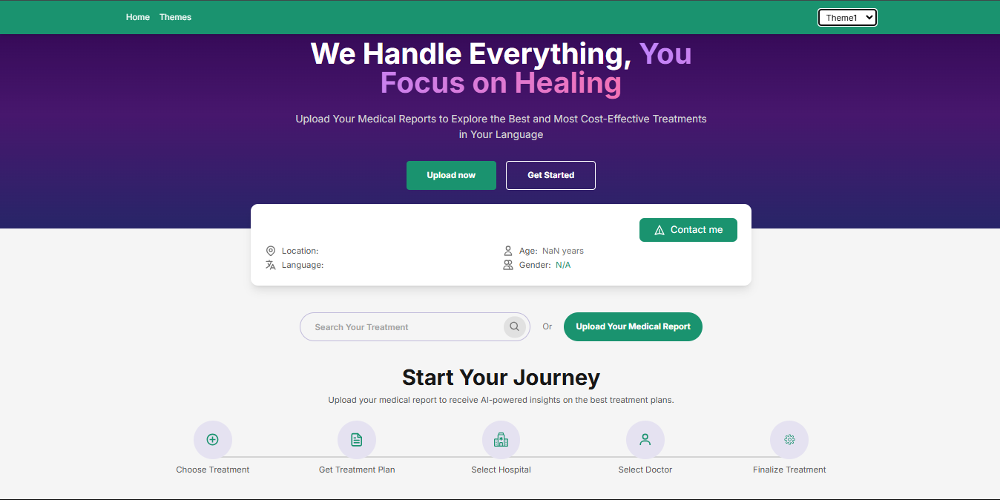
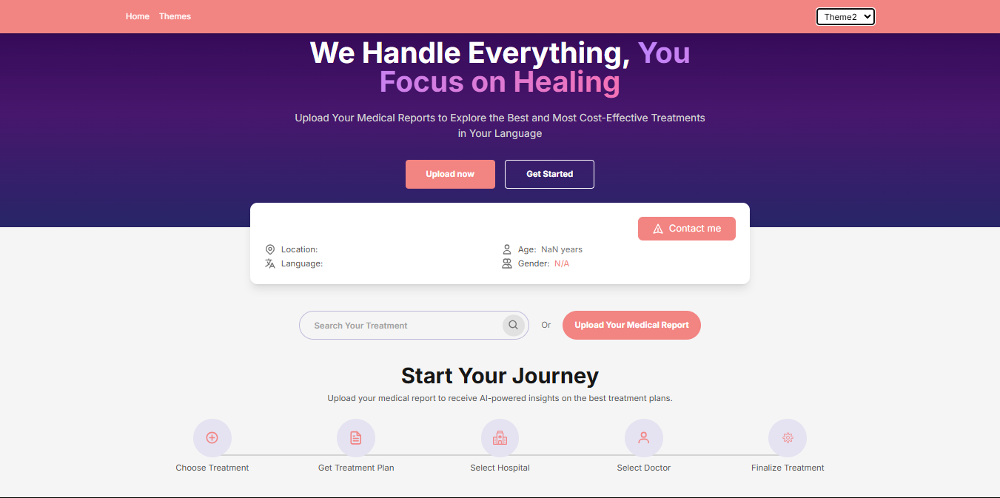

# GoGetWell.ai – Multi-Theme System Implementation (Assignment #2)

This project implements a **multi-theme system** for the GoGetWell.ai platform using React, TypeScript, TailwindCSS, Zustand, and Docker with Caddy. The goal is to provide customizable, specialty-focused themes across the interface for medical specialties like **Organ Transplant** and **Cosmetic Surgery**.

---

## 🚀 Features Implemented

### 🧭 Navigation
- Top navigation bar (`MenuBar`) with:
  - Home
  - Themes
  - Theme Switcher Dropdown (via `ThemeSelector.tsx`)
- Responsive and styled with Tailwind
- Fixed at the top with controlled `z-index` and width

### 🎨 Theme System
- **Default theme** (existing)
- **Two new specialty themes**:
  - Organ Transplant (`theme1`)
  - Cosmetic Surgery (`theme2`)
- Each theme includes:
  - Unique color palette (`colors.ts`)
  - Custom typography (`typography.ts`)
  - Global styling using CSS variables
- Dynamically applied using `ThemeProvider` with Zustand state

### ⚙️ State Management (Zustand)
- Zustand store with `specialty` value
- Persisted in `localStorage`
- Automatically reapplies on refresh

### 🌐 Routing
- Implemented using `react-router-dom`
- Routes:
  - `/` → Home page
  - `/themes` → Themes preview and selector page

### 🐳 Docker + Caddy Integration
- Set up subdomain routing using Docker and Caddy
- Subdomains like:
  - `http://demo.localhost`
  - `http://demo5.localhost`

---

## 📁 Project Structure Overview

```bash
src/
├── components/
│   ├── shared/
│   │   ├── MenuBar.tsx
│   │   └── ThemeSelector.tsx
│   └── template/
│       └── ThemeProvider.tsx
├── store/
│   └── themeStore.ts
├── views/
│   └── Home/
│       ├── components/        # Page UI
│       ├── themes/
│       │   ├── base/
│       │   ├── theme1/        # Organ Transplant
│       │   └── theme2/        # Cosmetic Surgery
│       └── index.tsx
├── assets/
│   └── styles/
│       ├── app.css
│       └── themes.css

## Technical Setup

### Prerequisites

- Docker
- Node.js (v14+)
- npm (v6+)

### Project Setup

1. Clone the repository
   git clone https://github.com/Ajith9620/Frontend-assignment-2
   cd Frontend-assignment-2


2. Install dependencies
   ```bash
   npm install
   ```

3. Set up Docker with Caddy for subdomain handling
   - Create a `Caddyfile` in the project root with the following content:
   ```
   {
     acme_ca https://acme-v02.api.letsencrypt.org/directory
   }

   # Wildcard subdomain handling
   *.localhost {
     # Add headers to identify the subdomain
     header {
       +X-Subdomain {labels.1}
     }
     reverse_proxy host.docker.internal:5173
   }

   # Handle base domain
   localhost {
     reverse_proxy host.docker.internal:5173
   }
   ```

4. Create a `docker-compose.yml` file with:
   ```yaml
   version: '3.8'
   services:
     caddy:
       image: caddy:2.7-alpine
       restart: unless-stopped
       ports:
         - "80:80"
         - "443:443"
       volumes:
         - ./Caddyfile:/etc/caddy/Caddyfile:ro
         - caddy_data:/data
         - caddy_config:/config
       extra_hosts:
         - "host.docker.internal:host-gateway" # This is important for Docker to resolve host machine
   volumes:
     caddy_data:
     caddy_config:
   ```

5. Start the Docker Caddy server:
   ```bash
   docker-compose up -d
   ```

6. Start the development server:
   ```bash
   npm run dev
   ```

7. Access the application via subdomains:
   - https://demo.localhost
   - https://demo5.localhost
   - https://seostore.localhost

## 📸 Screenshots

### Organ Transplant Theme


### Cosmetic Surgery Theme


## 📚 How to Add New Themes

1. Create a new folder in:

2. Add the following files to the new theme folder:

- `colors.ts`
- `typography.ts`

3. Update `themeStore.ts` to include the new theme name in the `specialty` options.

4. Add CSS variables for the new theme to `themes.css`:

```css
.theme-your-theme-name {
  --primary: #yourColor;
  --primary-deep: #yourDeepColor;
  --primary-mild: #yourMildColor;
}
```

### 📦 Technologies Used
* React + TypeScript
* TailwindCSS
* Zustand (with localStorage)
* Docker + Caddy (for subdomain routing)
* React Router

### 📌 Final Notes
* All themes are fully responsive and mobile-friendly.
* Theme selection is persistent across reloads using Zustand and localStorage.
* You can add any number of themes by following the steps above.
